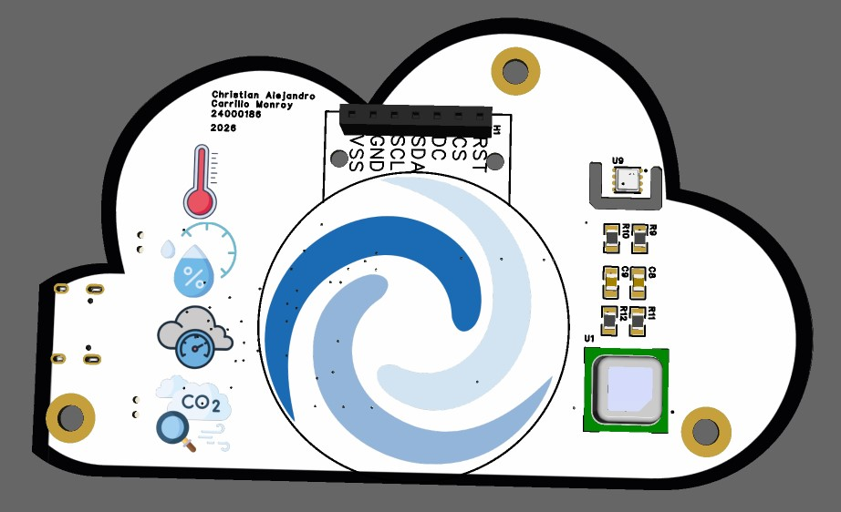
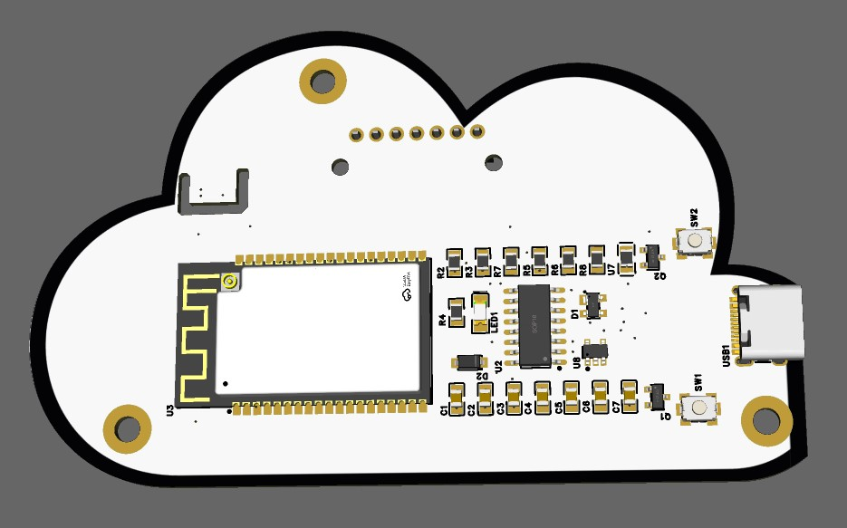
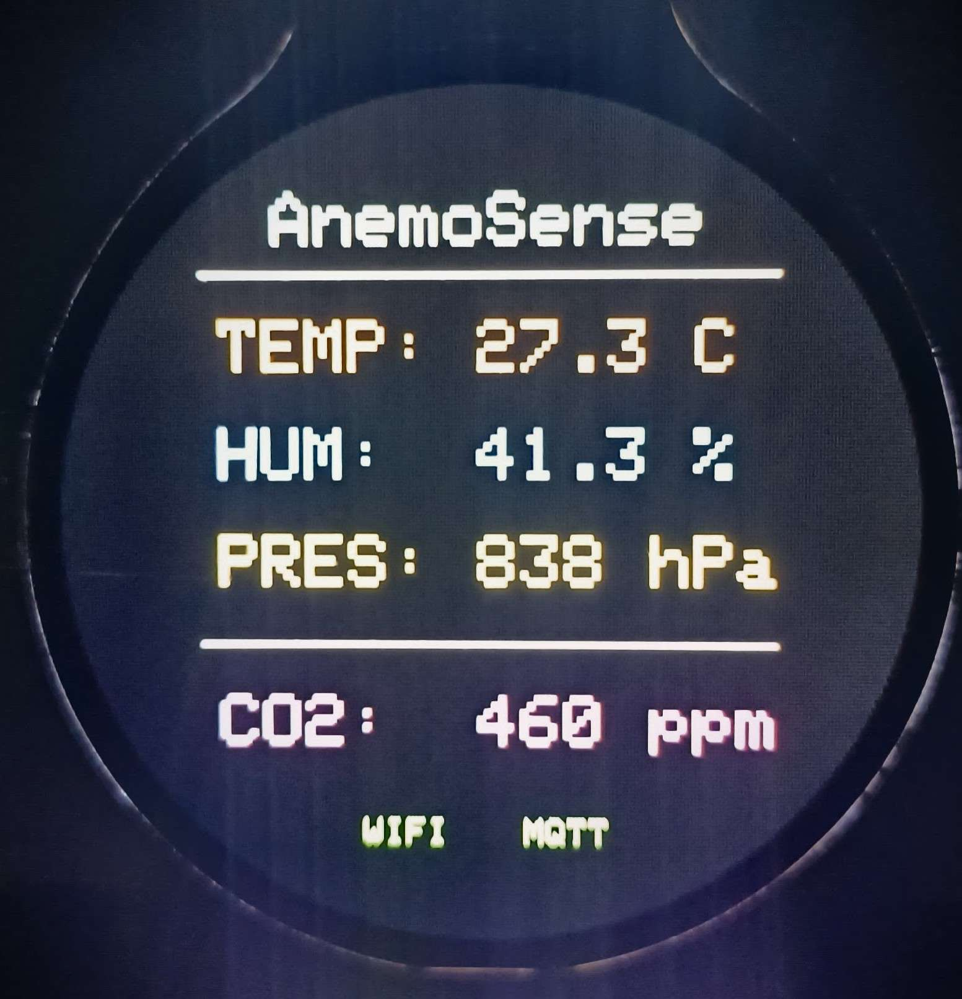
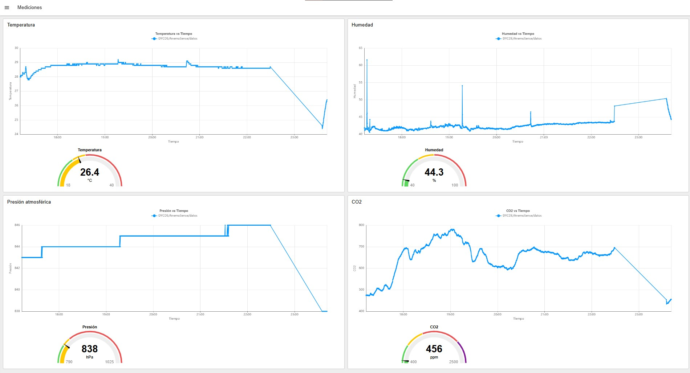

# AnemoSense
Dispositivo IoT de calidad de aire en espacios cerrados.
Utiliza los conocimientos de diseño aprendidos en el curso "Diseño y Construcción de Dispositivos Electrónicos" (DYCDE).

Su objetivo es la recolección de datos de:
1. Temperatura (°C)
2. Humedad (%)
3. Presión atmosférica (Pa)
4. CO2 (ppm)

Esto lo consigue através de los sensores BME680 y Sensirion SCD41, con sus módulos embebidos en la PCB.

Cuenta con un módulo de una pantalla TFT GC9A01 para leer los datos medidos por los sensores.

<h1>Uso objetivo</h1>

El dispositivo permite consultar en cualquier momento la calidad del aire en un ambiente cerrado, proporcionando información relevante para que el usuario pueda tomar medidas con el objetivo de mitigar los posibles problemas y mejorar las condiciones del entorno.

Está hecho para catedráticos, que podrán consultar información sobre la calidad de aire en cualquier momento y contrarrestar los posibles efectos negativos del ambiente, y los estudiantes, quienes se beneficiarán de la mejoría del ambiente al tener mejores condiciones para el estudio y el aprendizaje.

<h2>PCB</h2>

  

  

<h2>Interfaz en la pantalla</h2>

  

<h2>Dashboard</h2>

https://team-christian-carrillo-alecarrillomonroybach-44b9-79d6cf2b.flowfuse.cloud/dashboard/mediciones

  

<h1>📌 Pinout</h1>

<h2>BME680 - Comunicación I²C 0x77</h2>

<table>

<tr>
    <th>BME680</th>
    <th>ESP32</th>
</tr>

<tr>
    <td>VDD</td>
    <td>3.3V</td>
</tr>

<tr>
    <td>GND</td>
    <td>GND</td>
</tr>

<tr>
    <td>VDDIO</td>
    <td>3.3V</td>
</tr>

<tr>
    <td>SDO</td>
    <td>3.3V</td>
</tr>

<tr>
    <td>CSB</td>
    <td>3.3V</td>
</tr>

<tr>
    <td>SDI</td>
    <td>GPIO21</td>
</tr>

<tr>
    <td>SCL</td>
    <td>GPIO22</td>
</tr>

</table>

<h2>SCD41 - Comunicación I²C 0x62</h2>

<table>

<tr>
    <th>SCD41</th>
    <th>ESP32</th>
</tr>

<tr>
    <td>VDD</td>
    <td>3.3V</td>
</tr>

<tr>
    <td>VDDH</td>
    <td>3.3V</td>
</tr>

<tr>
    <td>GND</td>
    <td>GND</td>
</tr>

<tr>
    <td>SDA</td>
    <td>GPIO21</td>
</tr>

<tr>
    <td>SCL</td>
    <td>GPIO22</td>
</tr>

</table>

<h2>GC9A01 - Comunicación SPI</h2>

<table>

<tr>
    <th>SCD41</th>
    <th>ESP32</th>
</tr>

<tr>
    <td>RST</td>
    <td>GPIO4</td>
</tr>

<tr>
    <td>CS</td>
    <td>GPIO5</td>
</tr>

<tr>
    <td>DC</td>
    <td>GPIO2</td>
</tr>

<tr>
    <td>SDA</td>
    <td>GPIO23</td>
</tr>

<tr>
    <td>SCL</td>
    <td>GPIO18</td>
</tr>

<tr>
    <td>GND</td>
    <td>GND</td>
</tr>

<tr>
    <td>VCC</td>
    <td>3.3V</td>
</tr>

<h1>Contacto</h1>

24000186@galileo.edu

</table>

</body>
</html>
